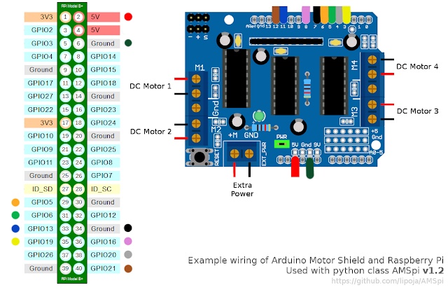

# Self driving excavator project

This project uses Ardiuno motor shield with Raspberry Pi 4 and raspberry camera.
Excavator will move near to given object attempt with take it with excavator bucket.

## Set up your hardware

Before you begin, you need to [set up your Raspberry Pi](
https://projects.raspberrypi.org/en/projects/raspberry-pi-setting-up) with
Raspbian (preferably updated to Buster).

You also need to [connect and configure the Pi Camera](
https://www.raspberrypi.org/documentation/configuration/camera.md).

And to see the results from the camera, you need a monitor connected
to the Raspberry Pi. It's okay if you're using SSH to access the Pi shell
(you don't need to use a keyboard connected to the Pi)—you only need a monitor
attached to the Pi to see the camera stream.

## Setup your Ardiuno motor shield

1. Connect Ardiuno motor shield to Raspberry Pi 4 as following schema.
  
2. Connect your Excavator motors with Ardiuno motor shield motor like above schema.
3. Test with `python3 test_motor_connection.py`
   If everything get connected your motors will move one by one.

4. Connect your camera to Raspberry pi 4 board.
5. Test with camera with `python3 detect_picamera.py`
6. <Working on how to detect distances and catch the object with bucket>
